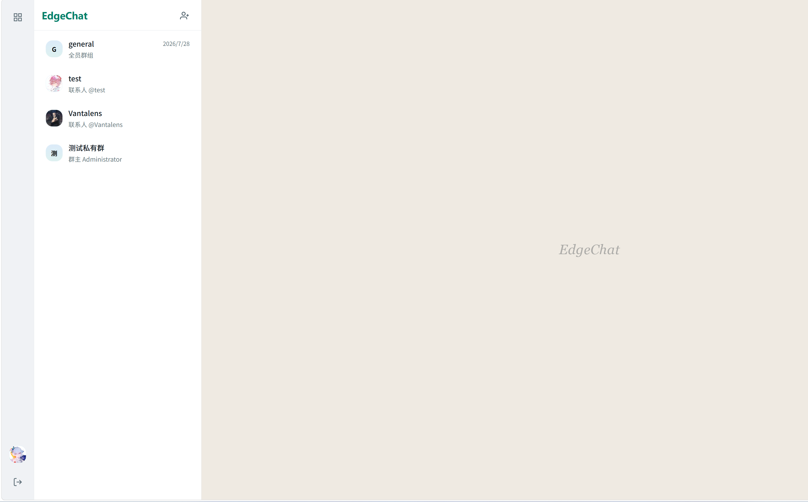
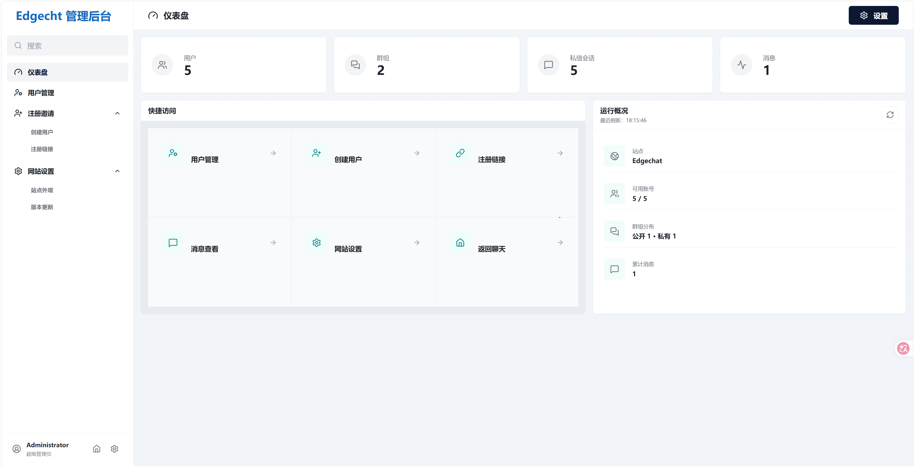

<div align="center">
  
</div>

[English README](README.en.md) · [GitHub 仓库](https://github.com/gdz66601/Edgechat) · [项目文档](https://echat.azora.top/) · [开源协议（GPL v3 或更高版本）](https://www.gnu.org/licenses/gpl-3.0)

EdgeChat 是一个部署在 Cloudflare 上的聊天系统，提供账号体系、公开群组、私有群组、私信、实时消息、文件上传和管理员后台，目标是在 Cloudflare 生态中以较低运维成本实现一套可直接落地的站内 IM。

本项目采用 `GPL-3.0-or-later` 协议，详见 [LICENSE](LICENSE)。

## 界面预览

<table>
  <tr>
    <td width="50%" align="center"><strong>聊天界面</strong></td>
    <td width="50%" align="center"><strong>管理后台</strong></td>
  </tr>
  <tr>
    <td width="50%"></td>
    <td width="50%"></td>
  </tr>
</table>

## 功能特性

- 管理员创建用户，不开放自助注册
- 支持公开群组、私有群组与私信会话
- 群主管理成员，管理员可查看任意群组和私信消息
- 支持实时消息、历史消息分页、消息检索、文件发送
- 支持文件上传与头像管理
- 后台一级导航包含仪表盘、用户管理、注册邀请、信息查看、网站设置，可直接进入消息巡检功能
- 管理员可在网站设置中由浏览器直接比对源码仓库，检查当前部署是否有更新
- 现代化 Liquid Glass 风格界面，已适配移动端并支持基础无障碍能力
- 支持定时硬删除过期消息

## 技术栈

- 前端：Vue 3、Vue Router、Vite
- 后端：Cloudflare Workers、Hono
- 实时层：Durable Objects WebSocket Hibernation
- 数据库：Cloudflare D1
- 会话：Cloudflare KV
- 文件：Cloudflare R2
- 部署：Wrangler、GitHub Actions

## 部署

### GitHub Actions 自动部署

推荐优先使用 GitHub Actions 部署，适合长期维护和生产环境更新。

- 快速开始：<https://echat.azora.top/guide/getting-started.html>
- 详细教程：<https://echat.azora.top/guide/actions-deploy.html>

仓库内已提供 `.github/workflows/deploy-worker.yml`，推送到 `master` 或 `main`，或手动触发 `workflow_dispatch` 后即可执行自动部署。
服务端加密密钥由部署流程管理。仓库所有者只需配置 `CLOUDFLARE_API_TOKEN` 和 `CLOUDFLARE_ACCOUNT_ID`：首次部署会生成随机 AES-256 密钥环并作为 `EDGECHAT_ENCRYPTION_KEYRING` Worker Secret 与代码一起上传；后续部署检测到该 Secret 后会原样保留，不会重新生成或覆盖。

如果运维方需要自行备份密钥、迁移历史 R2 附件或执行密钥轮换，也可以在首次部署前可选配置同名 GitHub Repository Secret。格式为：

```json
{"activeKeyId":"v1","keys":{"v1":"BASE64_ENCODED_32_BYTE_KEY"}}
```

密钥不能提交到仓库。老版本 D1 中的明文消息保持兼容读取，并由 Worker 的定时任务分批、幂等地加密；默认每轮最多处理 20 批、每批 100 条，中断后会继续。R2 覆盖迁移仍需先完成 D1 与 R2 备份，再从 Actions 手动运行 `Deploy Worker` 并填写 `BACKUP_COMPLETED`。

本地开发时复制 `.dev.vars.example` 为 `.dev.vars` 并替换示例密钥。Docker 启动前通过 `EDGECHAT_ENCRYPTION_KEYRING` 环境变量传入同样格式的密钥环。

### 手动部署

如果你希望本地手动部署，完整步骤、资源准备和注意事项请查看文档站教程：

- 手动部署教程：<https://echat.azora.top/guide/getting-started.html>
- 文档首页：<https://echat.azora.top/>
- Docker 本地部署：[DOCKER.md](DOCKER.md)

## 快速开始

### 安装依赖

```bash
npm install
```

### 前端开发

```bash
npm run dev:frontend
```

### 本地构建

```bash
npm run build
```

### 本地手动发布

```bash
npm run deploy
```

在非交互环境下部署时，需要提前设置 `CLOUDFLARE_API_TOKEN`。

后台更新检查会在构建时自动记录当前 GitHub 仓库、分支和提交。为了获得准确结果，手动部署应在 Git 仓库内基于已经推送的干净提交构建；源码仓库需要保持公开，浏览器才能直接调用 GitHub Compare API，整个过程不会创建定时任务。

PowerShell 示例：

```powershell
$env:CLOUDFLARE_API_TOKEN = "your-token"
npm run deploy
```

## 项目结构

```text
edgechat/
├─ assets/
│  └─ previews/
│     ├─ chat-home.png
│     └─ admin-dashboard.png
├─ frontend/
│  ├─ src/
│  │  ├─ api.js
│  │  ├─ router.js
│  │  ├─ store.js
│  │  ├─ ws.js
│  │  ├─ styles.css
│  │  ├─ components/ui/
│  │  └─ pages/
│  └─ vite.config.js
├─ worker/
│  ├─ schema.sql
│  ├─ migrations/
│  └─ src/
│     ├─ index.js
│     ├─ auth.js
│     ├─ db.js
│     ├─ middleware.js
│     ├─ utils.js
│     ├─ api/
│     └─ do/
├─ wrangler.toml
├─ package.json
├─ README.md
├─ README.en.md
└─ LICENSE
```

更多实现说明可查看 [TECHNICAL.md](TECHNICAL.md) 和文档站：<https://echat.azora.top/>

## 贡献

欢迎提交 Issue 和 Pull Request，一起完善 EdgeChat。

## 贡献者

感谢所有为项目提供帮助的贡献者：

[](https://github.com/gdz66601/Edgechat/graphs/contributors)

## 鸣谢

感谢 <a href="https://linux.do" target="_blank">linux do</a> 在推广方面为本项目做出的贡献。

## 协议说明

本项目采用 `GNU GPL v3.0 or later`。

你可以使用、修改和分发本项目；如果你分发修改版本，需要继续提供对应源代码，并保持 GPL 兼容。
